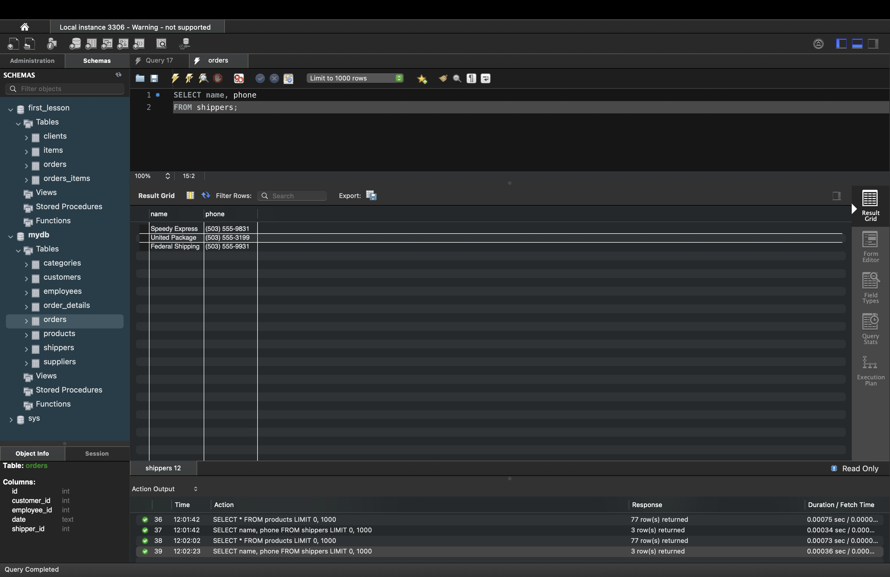

# Relational Databases: Concepts and Techniques: базові SQL-запити (MySQL)

Цей репозиторій містить рішення домашнього завдання з теми **SELECT / агрегатні функції / DISTINCT / WHERE / GROUP BY** у **MySQL**.

У роботі виконано 5 завдань, для кожного:
- написано SQL-запит;
- зроблено скріншот результату в **MySQL Workbench**;
- додано матеріали в репозиторій.

> Примітка: якщо назви файлів зі скрінами у вашому репозиторії відрізняються — просто замініть шляхи в секції **Скріншоти** нижче.

---

## Зміст
1. [Вимоги](#вимоги)
2. [Як перевірити у MySQL Workbench](#як-перевірити-у-mysql-workbench)
3. [Рішення](#рішення)
   - [1. SELECT * та вибір конкретних колонок](#1-select--та-вибір-конкретних-колонок)
   - [2. AVG / MAX / MIN для price](#2-avg--max--min-для-price)
   - [3. DISTINCT category_id та price + сортування + LIMIT 10](#3-distinct-category_id-та-price--сортування--limit-10)
   - [4. COUNT продуктів у діапазоні 20–100](#4-count-продуктів-у-діапазоні-20100)
   - [5. COUNT та AVG price по supplier_id](#5-count-та-avg-price-по-supplier_id)
4. [Скріншоти](#скріншоти)

---

## Вимоги
- **MySQL Server** (будь-яка актуальна версія)
- **MySQL Workbench**
- База даних із таблицями:
  - `products` (має містити колонку `price`, а також `category_id`, `supplier_id`)
  - `shippers` (має містити колонки `name`, `phone`)

---

## Як перевірити у MySQL Workbench
1. Відкрийте MySQL Workbench та підключіться до сервера.
2. Виберіть потрібну схему (database) у панелі **SCHEMAS**.
3. Вставте SQL-запит у Query Editor.
4. Натисніть **⚡ Execute** (або `Ctrl+Enter` / `Cmd+Enter`).
5. Перевірте результат у **Result Grid** і зробіть скріншот.

---

## Рішення

### 1. SELECT * та вибір конкретних колонок

**1.1. Вибрати всі стовпчики з таблиці `products`:**
```sql
SELECT *
FROM products;
```

**1.2. Вибрати тільки `name`, `phone` з таблиці `shippers`:**
```sql
SELECT name, phone
FROM shippers;
```

---

### 2. AVG / MAX / MIN для price

Знайти середнє, максимальне та мінімальне значення `price` у таблиці `products`:

```sql
SELECT
  AVG(price) AS avg_price,
  MAX(price) AS max_price,
  MIN(price) AS min_price
FROM products;
```

---

### 3. DISTINCT category_id та price + сортування + LIMIT 10

Обрати **унікальні пари** значень `(category_id, price)`, відсортувати за `price` за спаданням і показати лише 10 рядків:

```sql
SELECT DISTINCT category_id, price
FROM products
ORDER BY price DESC
LIMIT 10;
```

> Важливо: `DISTINCT` застосовується до всього набору колонок у SELECT, тому ставиться **один раз**.

---

### 4. COUNT продуктів у діапазоні 20–100

Порахувати кількість продуктів, ціна яких у межах **від 20 до 100 (включно)**:

```sql
SELECT COUNT(*) AS products_count
FROM products
WHERE price BETWEEN 20 AND 100;
```

---

### 5. COUNT та AVG price по supplier_id

Порахувати кількість продуктів та середню ціну для кожного постачальника (`supplier_id`):

```sql
SELECT
  supplier_id,
  COUNT(*)   AS products_count,
  AVG(price) AS avg_price
FROM products
GROUP BY supplier_id;
```

---

## Скріншоти

Нижче — місця для скрінів. Якщо ваші файли названі інакше, просто замініть шляхи.

> Рекомендована структура: `screenshots/`

### Завдання 1
- 1.1 `SELECT * FROM products;`  
  

- 1.2 `SELECT name, phone FROM shippers;`  
  

### Завдання 2
- `AVG / MAX / MIN price`  
  

### Завдання 3
- `DISTINCT category_id, price` + `ORDER BY price DESC` + `LIMIT 10`  
  

### Завдання 4
- `COUNT(*) WHERE price BETWEEN 20 AND 100`  
  

### Завдання 5
- `GROUP BY supplier_id` + `COUNT(*)` + `AVG(price)`  
  

---

## Автор
- **Ваше ім’я / нікнейм**: _додайте за бажанням_
